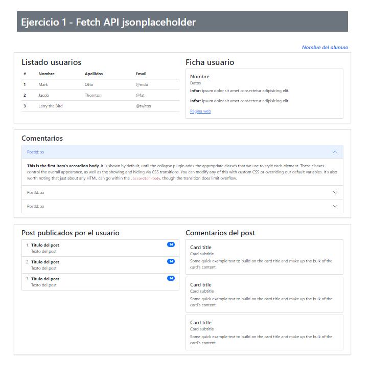
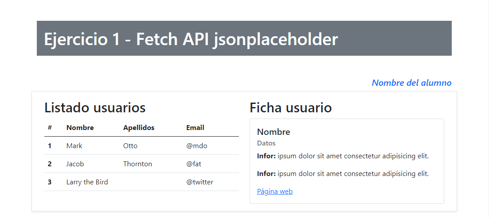
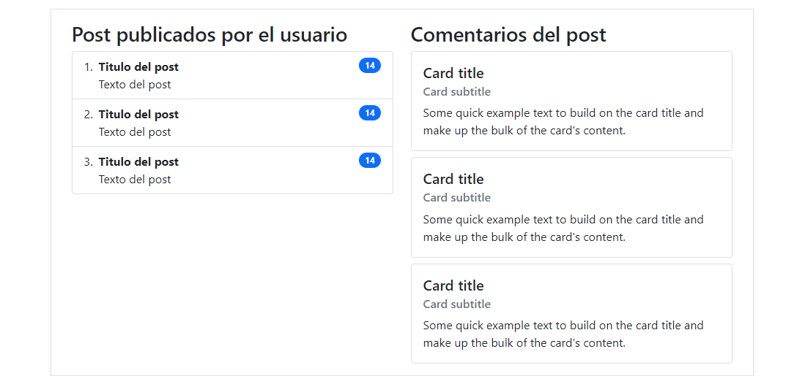

# UF4 Exercici 1
## Exercicis amb FETCH
L'objectiu és crear una web que consumeixi les dades de l'API REST 'Jsonplaceholder'. 
(Pots descarregar-te la interficie)

*Realitza els següents exercicis en una branca amb nom '**fetch**'*

### Exercici 1.1 Taula amb informació dels usuaris
Crea una web que mostri, a partir de l'API de Jsonplaceholder:
- Un llistat amb els 5 primers usuaris mostrant l'identificador, nom i correu electrònic.
### Exercici 1.2 Ficha usuaris
- Crea la lògica necessària perquè en fer clic en un usuari apareguin totes les dades en una fitxa.

  

### Exercici 1.3 Publicacions publicades
- Mostra els darrers 5 post publicats per l'usuari i el nombre de comentaris que té cada post.
  
## Exercicis amb Async/await

### Exercici 1.4 Comentaris
- Mostra, al costat, els comentaris relacionats amb el post seleccionat .

