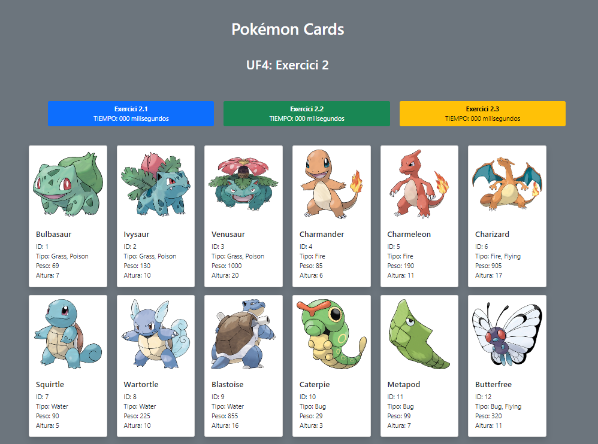

# UF4 Exercici 2
L'objectiu d'aquest exercici consisteix en experimentar les diferents maneres de fer peticions asincrones a una api.

## Exercici 2.0
Crea una funció que rep un array com el del model `ejemploDePeticion` i injecta en el document un conjunt de `cards` com les del prototip html.
## Exercici 2.1
Crea una funció que faci una petició a la api 'pokeapi' (**fent servir fetch, .then, .catch i .finally **) i que retorni un array amb la informació dels 4 primers pokemons en forma d'objectes. 
Les peticions no s'han de fer en cascada.

Actualitza la lògica perquè en prémer el botó corresponent es cridi aquesta funció i es mostri per pantalla els pokemons de l'array obtingut.

## Exercici 2.2
Fes el mateix exercici però ara **encavalcant les peticions** de manera que els pokemos es mostrin en l'ordre correcte.
Mostra al costat del botó el temps que s'ha fet servir.

Actualitza la lògica perquè en prémer el botó corresponent es cridi aquesta funció i es mostri per pantalla els pokemons de l'array obtingut.

## Exercici 2.3
Fes el mateix exercici fent servir fetch i .then perquè totes les peticions es facin a l'hora.
Utilitza **new Promise**, de manera que les dades es mostrin per pantalla una vegada s'han resolt totes les peticions.
Mostra el temps total que ha trigat.

Actualitza la lògica perquè en prémer el botó corresponent es cridi aquesta funció i es mostri per pantalla els pokemons de l'array obtingut.